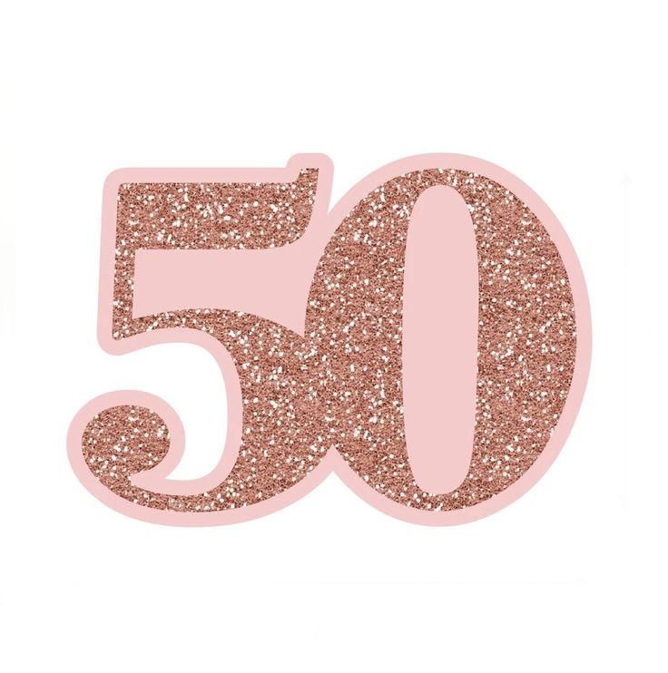

# peoplechange-50-
<!DOCTYPE html>
<html lang="en">

<head>
    <title>¡¡¡MIS 50'S!!!</title>
</head>
<meta charset="UTF-8" />

<body background="bities.gif">
<marquee bgcolor="#FF7070" behavior="alternate" direction="left">
            <b> ¡¡¡Juliza cumple 50!!! </b>
        </marquee>
	
 

    <header>
    </header>
    

    

        

        
 ¡¡¡JULIZA CUMPLE 50!!! 

	 
Acompañanos este Lunes 29 de Julio 

	
a celebrar a una mujer inigualable, te esperamos a la

	
1:30 PM en la casa del río, no faltes o nos comeremos tu pastel

	<iframe style="border-radius:12px" src="https://open.spotify.com/embed/track/5QDLhrAOJJdNAmCTJ8xMyW?utm_source=generator" width="100%" height="352" frameBorder="0" allowfullscreen="" allow="autoplay; clipboard-write; encrypted-media; fullscreen; picture-in-picture" loading="lazy"></iframe>
        

</body>

</html>
